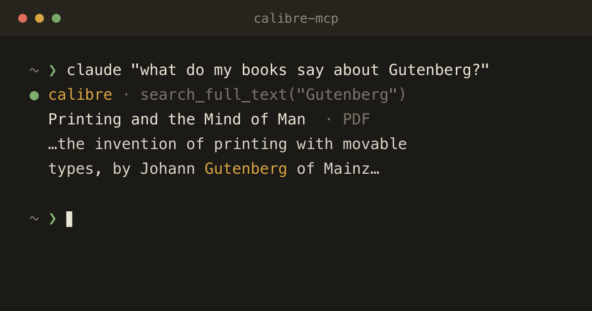

<div align="center">


# calibre-mcp

**Ask Claude about the books you own.**

Search your [calibre](https://calibre-ebook.com) library, search *inside*
the books, pull exact quotes, and read back your own highlights. It all stays
on your computer.

[](https://github.com/sivori/calibre-mcp/releases/latest)
[](https://calibre-ebook.com)
[](https://modelcontextprotocol.io)
[](LICENSE)



</div>

## Ask things like

> **"Find where the whale is first described in Moby-Dick and quote it."**
> Claude searches the text, pulls the passage from your copy, and cites it.
> No quoting from memory.

> **"Summarize everything I've highlighted about habit formation, with the book for each."**
> Your highlights and notes from calibre's viewer, gathered across books.

> **"What do I own by Ursula K. Le Guin, and which haven't I highlighted?"**
> Metadata search in calibre's own syntax, crossed with your annotations.

> **"Which of my books mention the printing press?"**
> Full-text search across every book, one snippet per match.

## Why it's different

- **Your actual books.** Answers come from the text in your library, not from
  what the model half-remembers. Quotes are word for word, with title and
  author.
- **Your reading, too.** Highlights and notes you made in calibre's viewer are
  available to Claude, so it knows what *you* found important.
- **Read-only.** No tool can change a book, a tag or a highlight.
- **Local.** The server listens on `127.0.0.1` only. Nothing is uploaded
  except what Claude reads to answer you. [Privacy policy](PRIVACY.md).
- **Zero dependencies.** Standard-library Python on both sides; nothing to
  `pip install`.

## Quick start

**1. Install the calibre plugin** (calibre 6 or later)

Download `calibre-mcp-<version>.zip` from the
[latest release](https://github.com/sivori/calibre-mcp/releases/latest). In
calibre, go to **Preferences → Plugins → Load plugin from file**, choose the
zip, and restart calibre.

**2. Connect Claude** (Claude Code, or Cowork on your computer)

Add **Calibre Library** from the Claude plugin directory, or in Claude Code:

```sh
claude plugin marketplace add sivori/calibre-mcp
claude plugin install calibre-mcp@sivori-calibre
```

**3. Turn on full-text search** (for searching inside books and quoting)

In calibre: **Preferences → Searching → Full text search**, then let it
index. Metadata search and highlights work without it.

That's it. Keep calibre open, and ask away.

<details>
<summary><b>More install options and requirements</b></summary>

- The Claude plugin runs `mcp/bridge.py` with your system `python3` (3.8 or
  later; on macOS it comes with the Xcode Command Line Tools or Homebrew). If
  calibre is closed, the tools say so instead of failing silently.
- It runs in Claude Code and in Cowork sessions on your computer, not in
  claude.ai chat on the web or phone, which doesn't run local servers.
- To build the calibre plugin yourself: `./build.sh` in a checkout, or install
  straight from it with `calibre-customize -b calibre_mcp`. On macOS,
  `calibre-customize` and `calibre-debug` are in
  `/Applications/calibre.app/Contents/MacOS/`.
- Add the **MCP** button to a toolbar under **Preferences → Toolbars & menus**
  to see the server's status, copy the connect command, or stop and start
  the server.
- Changed the port in calibre? Set `CALIBRE_MCP_PORT` in the environment
  Claude runs in.
- Without the Claude plugin, add the server to Claude Code directly:
  `claude mcp add --transport http calibre http://127.0.0.1:8395/mcp`

</details>

## Tools

| Tool | What it does |
| - | - |
| `library_info` | Book count, full-text indexing status, annotation count |
| `search_books` | Metadata search in calibre syntax: `author:dickens`, `tags:Fiction and pubdate:<1900` |
| `get_book` | Full metadata for one book, including description and custom columns |
| `list_categories` | Tags, authors, series, publishers or languages, with counts |
| `search_full_text` | Search inside the books; one highlighted snippet per matching book |
| `get_passage` | A longer passage around a match, for quoting in context |
| `get_annotations` | Highlights and notes from the calibre viewer, optionally filtered |

## Codex and other MCP clients

The calibre side is a plain MCP server, so any client that runs local
servers can use it. In the [Codex CLI](https://github.com/openai/codex):

```sh
codex mcp add calibre --url http://127.0.0.1:8395/mcp
```

That writes this to `~/.codex/config.toml`:

```toml
[mcp_servers.calibre]
url = "http://127.0.0.1:8395/mcp"
```

For a client that only runs stdio servers, use the bridge from a checkout
instead. It works the same way and starts even when calibre is closed:

```sh
codex mcp add calibre -- python3 /path/to/calibre-mcp/mcp/bridge.py
```

OpenAI's plugin directory only takes MCP servers at public HTTPS URLs, so
calibre-mcp isn't listed there. Your library never leaves your machine.

## Settings

**Preferences → Plugins → Calibre MCP → Customize plugin**: the port (default
`8395`) and whether the server starts with calibre.

## Privacy and security

- Binds to `127.0.0.1` only; it is not reachable from other machines.
- Rejects requests whose `Host` or `Origin` header isn't localhost, so a web
  page can't reach it via DNS rebinding.
- Calibre's `template:` searches are disabled in `search_books`. They can run
  Python, which would let anyone who can send a query (including text that
  talks a model into searching for it) run code inside calibre.
- Book text, descriptions and annotations go to your MCP client as-is. Treat
  them like any other untrusted content an assistant reads.
- The Claude plugin's bridge talks only to `127.0.0.1`. It has no other
  network access and stores nothing. See [PRIVACY.md](PRIVACY.md).
- There is no authentication: any process on your machine can read the
  library while calibre runs. That is the same access those processes already
  have to the library folder.

## How it works

```
 Claude ──stdio──▶ mcp/bridge.py ──HTTP──▶ calibre-mcp plugin ──▶ calibre's database API
 (Code, Cowork)    (Claude plugin)   127.0.0.1:8395  (inside calibre)       (your open library)
```

The calibre plugin runs a small MCP server inside calibre itself. Because it
uses calibre's own database API, there are no lock conflicts with the running
app, and switching libraries in calibre switches what Claude sees. The Claude
plugin adds a stdio bridge, so Claude can start the server like any other
local tool, and a skill that teaches Claude calibre's two search syntaxes
and how to quote accurately.

### Protocol notes

The plugin uses only the Python standard library, because calibre bundles its
own Python and third-party packages such as the MCP SDK aren't available. It
implements the `initialize`-based protocol revisions (`2025-03-26` through
`2025-11-25`) with plain JSON responses: no SSE streams and no sessions.
Clients on newer per-request-metadata revisions get a `400` on their probe and
fall back to `initialize`, as the spec describes. Claude Code does this.

## Development

```sh
calibre-debug tests/run_tests.py
claude plugin validate .
```

The tests build a throwaway library in a temp directory (including a
full-text index), call the tools directly, over HTTP and through the
bridge (under the system `python3`, with calibre up and with nothing
listening), then delete it. If you change a tool's schema, refresh the
bridge's offline tool list with `calibre-debug tests/run_tests.py --
--export-tools`.

To try the Claude plugin from a checkout: `claude --plugin-dir .`

To try a change in the real app: reinstall with `calibre-customize -b
calibre_mcp`, then run `calibre-debug -g` so the plugin's output shows in your
terminal.

## License

[GPL v3](LICENSE), like calibre itself. Not affiliated with calibre or its
authors.
